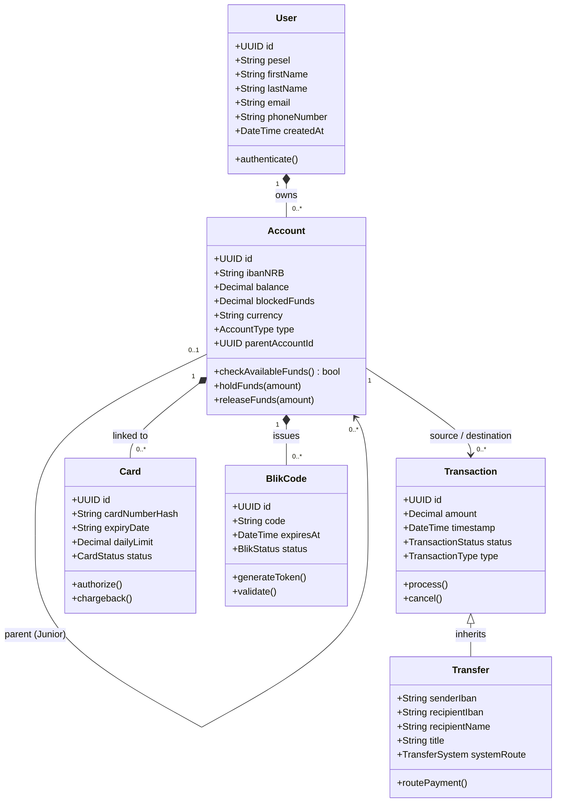

# Polish Bank B

Aplikacja webowa symulująca działanie polskiego banku detalicznego. Projekt grupowy — moduł **Bank PL (Polska) / Bank B**. Głównym zadaniem platformy jest orkiestracja płatności oraz integracja z zewnętrznymi dostawcami infrastruktury clearingowej i autoryzacyjnej.

## 1. Zakres funkcjonalny

- **Przelewy wewnętrzne** — realizacja między kontami w obrębie banku.
    
- **ELIXIR** — standardowy przelew krajowy, rozliczenie w sesjach dziennych.
    
- **Express Elixir** — przelew ekspresowy, działający w trybie 24/7/365.
    
- **SORBNET3** — przelew wysokokwotowy RTGS przez Narodowy Bank Polski.
    
- **SWIFT** — globalna sieć komunikacji finansowej do przelewów zagranicznych.
    
- **BLIK** — przelewy natychmiastowe P2P i płatności kodem z wykorzystaniem Polskiego Standardu Płatności.
    
- **Karty płatnicze** — integracja w modelu czterostronnym (transakcje w PLN).
    
- **Konto Junior (7-13 lat)** — logiki akceptacji transakcji przez rodziców i obsługa limitów.
    

## 2. Architektura i Stos Technologiczny

| **Warstwa**        | **Technologia**                                |
| ------------------ | ---------------------------------------------- |
| **Backend**        | Python 3.12 + Django 5 + Django REST Framework |
| **Frontend**       | Angular + Tailwind CSS + TypeScript            |
| **Baza danych**    | PostgreSQL 16                                  |
| **ORM**            | Django ORM (wbudowany)                         |
| **API Docs**       | Swagger UI                                     |
| **Auth**           | JWT — djangorestframework-simplejwt            |
| **Konteneryzacja** | Docker + Docker Compose                        |
| **Testy**          | pytest + pytest-django                         |

## 3. Wiedza Domenowa (Architektura Płatności)

Poniższe reguły biznesowe stanowią fundament logiki naszej aplikacji. Ich poprawne zaimplementowanie determinuje poprawny routing przelewów. Systemy płatnicze różnią się przeznaczeniem, modelem działania i wymogami płynnościowymi. W systemie ELIXIR bank musi posiadać środki jedynie na pokrycie salda netto z danej sesji, podczas gdy SORBNET3 i Express Elixir wymagają pełnego pokrycia dla każdej transakcji (brutto).

### 3.1. ELIXIR (System Detaliczny)

Krajowy system rozliczeń międzybankowych w złotych prowadzony przez Krajową Izbę Rozliczeniową (KIR).

- **Mechanizm (DNS):** Rozrachunek netto odroczony w czasie (Deferred Net Settlement). System gromadzi przelewy w paczkach (batching) i rozlicza je w 3 sesjach dziennie (tylko w dni robocze).
    
- **Limity:** Maksymalna kwota pojedynczego przelewu to 1 000 000 PLN. Większe kwoty są odrzucane i muszą trafić do SORBNET3.
    
- **Format:** System przechodzi migrację z plików tekstowych na standard ISO 20022 XML.
    
- **Sytuacje brzegowe:**
    
    - **Nieistniejące konto:** Przelew trafia do banku docelowego. Gdy bank wykryje błąd, odsyła środki tzw. komunikatem zwrotnym (R-Transaction) w najbliższej sesji.
        
    - **Niewypłacalność banku:** Jeśli bank nie ma pokrycia w NBP na swoją pozycję netto, KIR stosuje mechanizm odwijania (_unwinding_) – usuwa zlecenia niewypłacalnego banku z sesji i przelicza salda pozostałych.
        

### 3.2. Express Elixir (Płatności Natychmiastowe)

System KIR przetwarzający przelewy w czasie rzeczywistym (24/7/365).

- **Mechanizm (Pre-funded):** Opiera się na rachunku powierniczym w NBP. Banki muszą wcześniej zdeponować tam odpowiednią pulę pieniędzy.
    
- **Limity:** Systemowy limit wynosi 100 000 PLN (250 000 PLN dla organów celno-skarbowych), jednak banki nakładają wewnętrzne limity detaliczne (np. 3 000 - 10 000 PLN).
    
- **Sytuacje brzegowe:**
    
    - **Weryfikacja online:** Numer konta jest weryfikowany przed pobraniem środków. Jeśli jest błędny, transakcja zostaje błyskawicznie odrzucona (odmowa autoryzacji).
        
    - **Upadek banku:** System natychmiastowo blokuje nowe przelewy od niewypłacalnego banku, gdy tylko wyczerpie on swój limit powierniczy.
        

### 3.3. SORBNET3 (RTGS)

Prowadzony przez NBP system dla płatności wysokokwotowych i pilnych. Gwarantuje ostateczność rozrachunku (settlement finality).

- **Mechanizm (RTGS):** Rozrachunek brutto w czasie rzeczywistym. Każde zlecenie jest księgowane natychmiast, bez kompensaty (nettingu).
    
- **Limity:** Brak limitu górnego. Przelewy powyżej 1 000 000 PLN muszą być realizowane wyłącznie tą drogą.
    
- **Zarządzanie Płynnością (Gridlock Resolution):**
    
    - Jeśli bank nie ma płynności, przelew trafia do kolejki scentralizowanej.
        
    - **Bypass FIFO:** Mniejsze przelewy mogą ominąć zablokowany duży transfer.
        
    - **LSM:** Algorytmy NBP optymalizują kolejki, kompensując w tle wzajemne zobowiązania banków.
        
    - Niezrozliczone zlecenia na koniec dnia operacyjnego są trwale anulowane.
        

### 3.4. IBAN i SWIFT (Ruch Zagraniczny)

- **IBAN (ISO 13616):** Składa się z kodu kraju (np. PL), 2 cyfr kontrolnych i numeru BBAN.
    
    - **Zasada Modulo 97:** Algorytm walidacyjny oblicza sumę kontrolną w ułamku sekundy. Chroni to przed pusto-przebiegami, odrzucając literówki w aplikacji nadawcy przed inicjacją.
        
- **SWIFT:** Architektura Store-and-Forward z routingiem przez banki korespondentów w oparciu o klucze autoryzacyjne RMA.
    
    - **Konta:** Rozrachunek bazuje na rachunkach Nostro ("nasze u was") i Vostro ("wasze u nas").
        
    - **Komunikaty zwrotne:** Odrzucenie przelewu np. z powodu braku konta wymaga ręcznej interwencji i wygenerowania komunikatów zwrotnych. Pośrednicy pobierają bezzwrotne opłaty manipulacyjne (lifting fees).
        

### 3.5. BLIK (Polski Standard Płatności)

BLIK działa jako warstwa abstrakcji, nie posiadająca własnej księgi głównej. Opiera się o systemy KIR i agentów rozliczeniowych.

- **Kody 6-cyfrowe:** Oparte na dynamicznej tokenizacji (ważne 2 minuty). PSP mapuje kod i przesyła prośbę autoryzacyjną (push) do banku wydawcy. Bank natychmiastowo zakłada blokadę (hold), a ostateczny rozrachunek w formie kompensaty zachodzi w nocnej sesji Elixir.
    
- **P2P na Telefon:** PSP prowadzi Bazę Aliasów, która tłumaczy nr telefonu na IBAN. Po weryfikacji transakcja jest w pełni oddawana do systemu Express Elixir (rozrachunek na koncie pre-funded).
    

### 3.6. Karty Płatnicze (Model Czterostronny)

System oparty na relacjach: Cardholder ↔ Issuer (Bank) ↔ Acquirer (Agent) ↔ Merchant (Sklep).

- **Dual Message System (DMS):**
    
    - **Autoryzacja (Real-Time):** Komunikat w standardzie ISO 8583 sprawdza limity i zakłada blokadę autoryzacyjną na koncie.
        
    - **Clearing & Settlement (Odroczone):** Zazwyczaj na koniec dnia (EOD) Acquirer wysyła paczki transakcyjne, a sieć rozlicza je netto (DNS) w pieniądzu banku centralnego.
        
- **Sytuacje Brzegowe:**
    
    - **STIP (Stand-in Processing):** Jeśli Issuer ma awarię, sieć może awaryjnie autoryzować płatność (shadow balance).
        
    - **Uncaptured Authorization:** Jeśli merchant nie prześle rozliczenia na czas, założona na koncie klienta blokada (hold) wygasa automatycznie po 7-14 dniach.
        
    - **Chargeback:** Procedura obciążenia zwrotnego zabezpieczająca klienta. Ryzyko ponosi Acquirer.
        

## 4. Diagramy Architektoniczne

Poniższe diagramy korzystają z języka Mermaid. Można je podejrzeć bezpośrednio w repozytorium GitHub (renderują się automatycznie) lub w kompatybilnym edytorze Markdown.

### Model domenowy (UML Class Diagram)

Diagram przedstawiający strukturę głównych encji w systemie oraz relacje między nimi. Uwzględnia m.in. kompozycję między użytkownikiem a jego rachunkami, rekurencyjną relację dla subkont (Konto Junior podpięte pod konto rodzica) oraz rozszerzenie bazowej transakcji o specjalistyczny model przelewu zewnętrznego.




---

### 1. Kluczowe Encje (Tabele) i ich Rola

- **User (Użytkownik):** Centralny punkt systemu. Przechowuje dane osobowe klienta (PESEL, imię, nazwisko, kontakt) oraz datę utworzenia profilu. Stanowi on "właściciela", do którego przypisane są wszystkie inne zasoby.
    
- **Account (Rachunek):** Reprezentuje konto bankowe. Oprócz standardowego salda (`balance`), posiada bardzo ważne pole **`blockedFunds` (Środki zablokowane)**. Służy ono do obsługi mechanizmów _hold_ (np. przy autoryzacji karty lub BLIK-a), gdzie pieniądze są rezerwowane przed ostatecznym rozliczeniem.
    
- **Transaction (Transakcja):** Baza dla każdego ruchu finansowego. Rejestruje kwotę, datę, typ operacji oraz jej status (np. czy jest w trakcie procesowania, czy zakończona błędem).
    
- **Transfer (Przelew):** Rozszerzenie transakcji o dane niezbędne do wysyłki pieniędzy na zewnątrz. Posiada pole **`systemRoute`**, które decyduje o tym, czy dany przelew zostanie wysłany systemem ELIXIR, Express Elixir, czy SORBNET3.
    
- **Card (Karta):** Reprezentuje kartę płatniczą przypisaną do konta. Przechowuje limity dzienne oraz status (aktywna/zablokowana). Obsługuje procesy autoryzacji i reklamacji (_chargeback_).
    
- **BlikCode (Kod BLIK):** Encja odpowiedzialna za generowanie i walidację 6-cyfrowych tokenów mobilnych. Każdy kod ma przypisany czas wygaśnięcia (standardowo 2 minuty).
    

---

### 2. Logika Relacji (Powiązania)

Model opiera się na kilku kluczowych zależnościach biznesowych:

1. **Relacja Własności (User -> Account):** Jeden użytkownik może posiadać wiele rachunków (np. osobisty, oszczędnościowy, walutowy). Jest to relacja typu "jeden do wielu".
    
2. **Struktura Junior (Account -> Account):** To tzw. relacja rekurencyjna. Konto typu **Junior** posiada odnośnik do konta rodzica (`parentAccountId`). Dzięki temu system wie, do kogo wysłać prośbę o zatwierdzenie transakcji, gdy dziecko próbuje wydać pieniądze.
    
3. **Powiązanie Usług (Account -> Card/BlikCode):** Karty i kody BLIK są ściśle "przypięte" do konkretnego rachunku. To z tego rachunku pobierane są środki podczas autoryzacji.
    
4. **Historia Finansowa (Account -> Transaction):** Każdy rachunek jest powiązany z listą transakcji, gdzie może występować zarówno jako nadawca (obciążenie), jak i odbiorca (uznanie).
    
5. **Hierarchia Transakcji (Inheritance):** Przelew (`Transfer`) "dziedziczy" wszystkie cechy transakcji. Oznacza to, że każdy przelew jest transakcją, ale nie każda transakcja (np. opłata za prowadzenie konta) musi być przelewem zewnętrznym.
    

---

### 3. Funkcje Biznesowe w Modelu

W diagramie zdefiniowano metody, które realizują logikę opisaną w wytycznych:

- **`holdFunds()` / `releaseFunds()`:** Obsługa blokad środków pod transakcje kartowe i BLIK.
    
- **`routePayment()`:** Automatyczny wybór odpowiedniego systemu rozliczeniowego (np. wymuszenie SORBNET3 dla kwot powyżej 1 mln PLN).
    
- **`checkAvailableFunds()`:** Sprawdzanie, czy po odjęciu blokad klient ma wystarczająco dużo pieniędzy na nową operację.
    
- **`chargeback()`:** Specyficzna dla kart procedura zwrotu środków w sytuacjach spornych.

## 5. Konfiguracja Systemu Czasowego (Sesje)

Do celów testowych, czasy sesji rozliczeniowych są wyodrębnione do pliku `src/pl_bank/payment_config.json`. W środowisku deweloperskim zaleca się ich drastyczne skrócenie, aby pominąć konieczność oczekiwania na rzeczywiste godziny rozliczeń KIR.

```
{
  "PaymentSessions": {
    "Elixir": {
      "BatchWindowMinutes": 1,
      "SessionHours": [9, 12, 15]
    },
    "ExpressElixir": {
      "TimeoutMinutes": 2
    },
    "Sorbnet": {
      "TimeoutSeconds": 10
    }
  }
}
```


## 6. Środowisko Uruchomieniowe (Docker)

Zgodnie z wytycznymi, aplikacja jest obowiązkowo skonteneryzowana.

### 6.1. Wymagania

- Zainstalowany **Docker Engine / Docker Desktop** (lub Podman).
    
- Repozytorium **Git**.
    

### 6.2. Instrukcja Krok po Kroku

**1. Klonowanie repozytorium**

```
git clone https://github.com/jczesnak/Polish-Bank-B.git
```


```
cd polish-bank-b
``` 


**2. Konfiguracja środowiska** Skopiuj szablon zmiennych:

```
cp .env.example .env
```


```

Uzupełnij wartości w pliku `.env` (szczególnie linki do integracji dostarczonych przez inne zespoły):

POSTGRES_DB=plbank
POSTGRES_USER=twoj_user
POSTGRES_PASSWORD=twoje_haslo
POSTGRES_PORT=5433

DJANGO_SECRET_KEY=zmien na jakis klucz
JWT_SECRET=zmien_na_sekret_jwt

INTEGRATIONS_ELIXIR_URL=http://localhost:7001
INTEGRATIONS_EXPRESS_ELIXIR_URL=http://localhost:7002
INTEGRATIONS_SORBNET_URL=http://localhost:7003
INTEGRATIONS_CARDS_URL=http://localhost:7004
INTEGRATIONS_BLIK_URL=http://localhost:7005
```

**3. Budowa i Uruchomienie** Proces ten zautomatyzuje budowę kontenerów oraz wykona migracje ORM podczas startu aplikacji.

```
docker compose up --build
```

### 6.3. Dostęp do Usług Lokalnych

|                                          |                                                |
| ---------------------------------------- | ---------------------------------------------- |
| **Interfejs**                            | **Adres URL**                                  |
| **Frontend SPA (Angular)**               | `http://localhost:4200`                        |
| **Backend API (Django DRF)**             | `http://localhost:8000`                        |
| **Panel Administratora (GUI Operatora)** | `http://localhost:8000/admin/`                 |
| **Swagger UI (Dokumentacja API)**        | `http://localhost:8000/api/schema/swagger-ui/` |

> _Uwaga: Dostęp do panelu administratora wymaga uprzedniego wygenerowania konta poprzez komendę `python manage.py createsuperuser` wewnątrz kontenera backendu._

### 6.4. Obsługa Kontenerów

- Zatrzymanie usług: `docker compose down`
    
- Wyczyszczenie wirtualnych wolumenów (reset bazy danych): `docker compose down -v`
    

## 7. Struktura Repozytorium

```
polish-bank-b/
├── src/
│   ├── pl_bank/                  # Moduł główny konfiguracji Django
│   │   ├── settings.py
│   │   ├── urls.py
│   │   └── payment_config.json   # Konfiguracja czasów sesji
│   ├── accounts/                 # Moduł: użytkownicy, konta zwykłe, konta Junior
│   ├── transfers/                # Moduł: Routing płatności (Wewnętrzne, Elixir, Sorbnet)
│   ├── cards/                    # Moduł: Wydawnictwo kart (Integracja)
│   └── blik/                     # Moduł: Tokenizacja i autoryzacja BLIK
├── frontend/                     # Warstwa prezentacji (Angular + TypeScript)
├── docker-compose.yaml           # Rejestr orkiestracji usług
├── .env.example                  # Szablon konfiguracji
└── README.md
```

## 8. Zewnętrzne Punkty Wejścia (API)

Zarys najważniejszych endpointów backendu. Całość jest automatycznie dokumentowana w **Swagger UI**. Wzorujemy API na standardach RESTful.

|            |                                  |                                                                         |
| ---------- | -------------------------------- | ----------------------------------------------------------------------- |
| **Metoda** | **Ścieżka API**                  | **Opis**                                                                |
| `POST`     | `/api/auth/register/`            | Założenie nowej kartoteki klienta.                                      |
| `POST`     | `/api/auth/login/`               | Autoryzacja – generowanie Access/Refresh JWT.                           |
| `GET`      | `/api/accounts/{id}/`            | Pobieranie szczegółów wybranego rachunku.                               |
| `GET`      | `/api/accounts/{id}/balance/`    | Zwraca saldo bieżące oraz środki zablokowane (Pre-auth).                |
| `POST`     | `/api/transfers/internal/`       | Przelew wewnątrzbankowy.                                                |
| `POST`     | `/api/transfers/elixir/`         | Przelew skierowany do sesji KIR.                                        |
| `POST`     | `/api/transfers/express-elixir/` | Przelew natychmiastowy (weryfikacja limitu pre-funded).                 |
| `POST`     | `/api/transfers/sorbnet/`        | Przelew skierowany na kolejkę NBP (RTGS).                               |
| `POST`     | `/api/cards/authorize/`          | $$Webhook$$<br><br>Zapytanie autoryzacyjne od zewn. Agenta (Acquirera). |
| `POST`     | `/api/blik/generate/`            | Zwrot 6-cyfrowego tokena z przypisanym czasem ważności (TTL).           |
| `POST`     | `/api/blik/verify/`              | Weryfikacja zapytania z agenta rozliczeniowego i blokada salda.         |

## 9. Polityka Kontroli Wersji (Git Workflow)

1. Gałąź główna to `main`. Bezpośrednie wrzucanie do niej (push) jest zabronione.
    
2. Zarządzanie integracjami z innymi grupami odbywa się na stabilnej gałęzi `develop`.
    
3. Praca operacyjna przebiega na dedykowanych branchach typu `feature/PL-XX-krotki-opis`, z których należy otwierać Pull Requesty.

**Standard nazewnictwa commitów (Semantic Commits):**

- `Feat: ...` — Wprowadzanie nowych wymagań (np. nowa integracja płatnicza).
    
- `Fix: ...` — Łatanie znalezionych anomalii logicznych lub technicznych.
    
- `Docs: ...` — Aktualizacja niniejszej dokumentacji technicznej.
    
- `Refactor: ...` — Poprawy struktury bez wpływu na zewnętrzną architekturę aplikacji.
    

## 10. Zespół i podział zadań

Obie osoby w zespole pracują w modelu **Fullstack** (projektują oraz implementują funkcjonalności end-to-end: od modeli bazy danych i API w Django, po widoki użytkownika w Angularze). 

| Osoba                | **Zakres Obowiązków**                                                                                                                                                                                                                |
| -------------------- | ------------------------------------------------------------------------------------------------------------------------------------------------------------------------------------------------------------------------------------ |
| **Batłomiej Bogdan** | **Fullstack (Rozliczenia i Core):** Budowa architektury płatności, routing przelewów (Elixir, Sorbnet), implementacja mechanizmów zatorów płatniczych (Gridlock), środowisko Docker, widoki Angulara dla interfejsu operatora banku. |
| **Jakub Czesnak**    | **Fullstack (Autoryzacje i Detal):** Integracja systemów zewnętrznych (Karty płatnicze, API BLIK), logika subkont (Konta Junior), mechanizmy autoryzacji (JWT), widoki Angulara dla głównego panelu klienta detalicznego.            |
