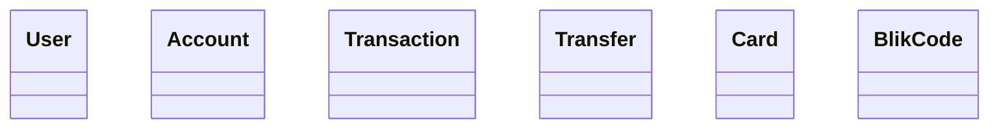
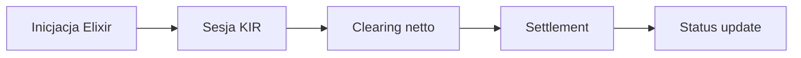
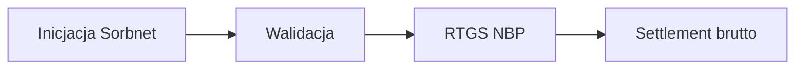
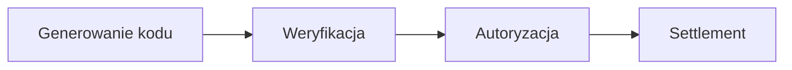

# PL Bank System

  

Aplikacja webowa symulująca działanie polskiego banku detalicznego. Projekt grupowy — moduł **Bank PL (Polska)**.

  

## Zakres

  

- Przelewy wewnętrzne między kontami

- Elixir — standardowy przelew krajowy (rozliczenie w sesjach dziennych)

- Elixir Express — przelew ekspresowy (rozliczenie w ciągu godziny)

- Sorbnet — przelew wysokokwotowy RTGS przez NBP

- BLIK — przelewy natychmiastowe (integracja)

- Karty płatnicze (integracja) — transakcje tylko w PLN

  

## Stack

  

| Warstwa | Technologia |

|---|---|

| Backend | Python 3.12 + Django 5 + Django REST Framework |

| Frontend | React + Vite + TypeScript |

| Baza danych | PostgreSQL 16 |

| ORM | Django ORM (wbudowany) |

| API Docs | drf-spectacular (OpenAPI / Swagger UI) |

| Auth | JWT — djangorestframework-simplejwt |

| Konteneryzacja | Docker + Docker Compose |

| Testy | pytest + pytest-django |

  

---

  

## Wiedza domenowa

  

### Elixir

  

Główny system do obsługi standardowych przelewów w PLN, prowadzony przez **Krajową Izbę Rozliczeniową (KIR)**. System detaliczny (masowy, drobne kwoty) oparty na modelu sesyjnym z rozliczeniem netto.

  

**Wymogi płynnościowe:** bank musi posiadać środki jedynie na pokrycie salda netto z danej sesji (nie pełnego wolumenu transakcji).

  

**Proces:**

1. **Batching** — bank zbiera przelewy od klientów i grupuje je w paczki, wysyłając do KIR przed cut-off time sesji.

2. **Netting (kompensata)** — KIR sumuje wszystkie zobowiązania i należności danego banku wobec pozostałych uczestników, wyliczając jedno saldo netto.

3. **Rozrachunek** — saldo netto trafia do NBP, który księguje kwotę na rachunku bieżącym banku.

4. **Księgowanie końcowe** — KIR przekazuje detale przelewów do banków docelowych, które księgują środki na kontach klientów.

  

**Format komunikatów:** system w trakcie transformacji z formatów płaskich na standard **ISO 20022 XML**.

  

**Sytuacje brzegowe:**

- **Błąd NRB** — algorytm mod 97 odrzuca błędny numer już na etapie wpisywania w bankowości elektronicznej.

- **Spóźniona wysyłka** — przelew trafia do bufora i oczekuje na kolejną sesję Elixir.

- **Zamknięty rachunek odbiorcy** — bank docelowy w kolejnej sesji generuje R-Transaction, która cofa środki do nadawcy.

  

---

  

### Elixir Express

  

System płatności natychmiastowych prowadzony przez **KIR**, działający w trybie **24/7/365** obok standardowego Elixira.

  

**Model rozrachunku:** brak modelu sesyjnego ani kompensaty. Rozrachunek odbywa się na specjalnym rachunku powierniczym prowadzonym przez NBP. Banki uczestniczące muszą z góry zablokować tam pulę środków (**pre-funding**).

  

**Format komunikatów:** natywnie **ISO 20022 XML** — każda transakcja procesowana jako osobny komunikat.

  

**Limity transakcji:**

- Limit systemowy KIR: **100 000 PLN** dla standardowego przelewu.

- **250 000 PLN** dla przelewów na rachunki organów celno-skarbowych.

- Banki komercyjne często nakładają niższe limity wewnętrzne dla klientów detalicznych (np. 5 000–10 000 PLN).

- Przelewy na kwotę **≥ 1 000 000 PLN** muszą być obowiązkowo realizowane przez SORBNET3 (wymóg prawny). Wyjątek: przelewy do ZUS i organów celno-skarbowych mogą iść Elixirem bez limitu kwotowego.

  

**Sytuacje brzegowe:**

- **Niedostępność banku odbiorcy** — system KIR natychmiast odrzuca przelew; środki nie opuszczają konta nadawcy, klient otrzymuje błąd w czasie rzeczywistym.

- **Niewypłacalność banku** — mechanizm pre-fundingu zapewnia pełne pokrycie; przelew jest realizowany tylko gdy bank ma zablokowane fizyczne pokrycie w NBP.

  

---

  

### SORBNET3

  

System RTGS (Real-Time Gross Settlement) prowadzony przez **Narodowy Bank Polski (NBP)**. Przetwarza transakcje wysokokwotowe bez kompensaty — każda wysłana złotówka natychmiast zmienia saldo banku w NBP.

  

**Wymogi płynnościowe:** bank musi mieć pełne pokrycie dla każdej pojedynczej transakcji (w odróżnieniu od Elixira, który rozlicza saldo netto).

  

**Godziny operacyjne:** 8:00–18:00 w dni robocze.

  

**Limity transakcji:** brak limitu maksymalnego (można przesłać np. 5 mld PLN jednym komunikatem). Brak limitu minimalnego — choć ze względu na wysokie opłaty wysyłanie małych kwot mija się z celem.

  

**Format komunikatów:** natywnie **ISO 20022 XML**.

  

**Proces:**

1. **Inicjacja i routing** — bank wysyła dyspozycję bezpośrednio do NBP.

2. **Weryfikacja płynności** — system sprawdza, czy bank-nadawca ma wystarczające środki na rachunku bieżącym w NBP.

3. **Natychmiastowy rozrachunek** — środki natychmiast pobierane od nadawcy i księgowane u odbiorcy. Przelew staje się nieodwołalny.

  

**Sytuacje brzegowe (brak płynności):**

- **Kolejkowanie** — transakcja trafia do wirtualnej poczekalni.

- **Bypass FIFO** — mniejsze późniejsze przelewy mogą ominąć zablokowany duży przelew, aby system nie uległ paraliżowi.

- **LSM (Liquidity Saving Mechanisms)** — algorytmy NBP aktywnie szukają zatorów płatniczych (gridlock). Jeśli banki wzajemnie czekają na siebie (A czeka na B, B na C, C na A), system kompensuje te transakcje w tle.

- **Kredyt śróddzienny** — bank może zaciągnąć w NBP szybki kredyt pod zastaw papierów wartościowych.

- **Ostateczne odrzucenie** — jeśli bank nie zdobędzie środków do końca dnia operacyjnego, wszystkie transakcje w kolejce zostają anulowane.

  

---

  

### BLIK

  

BLIK nie jest samodzielnym systemem rozrachunkowym — stanowi warstwę abstrakcji (nakładkę techniczną i autoryzacyjną) integrującą systemy bankowe, agentów rozliczeniowych i infrastrukturę KIR. Prowadzony przez **Polski Standard Płatności (PSP)**.

  

**A. Płatności kodem 6-cyfrowym (e-commerce, POS, ATM)**

  

Oparte na mechanizmie dynamicznej tokenizacji. Kod jest ważny **2 minuty**.

  

1. **Generowanie** — aplikacja bankowa (issuer) żąda tokenu z systemu PSP; generowany jest 6-cyfrowy kod.

2. **Routing w czasie rzeczywistym** — klient wpisuje kod; terminal/bramka przesyła go do agenta rozliczeniowego (np. eService, PayU), ten do PSP. PSP mapuje kod na konkretną aplikację bankową i wysyła push na smartfon klienta.

3. **Autoryzacja** — klient potwierdza PIN-em w aplikacji; bank blokuje środki.

4. **Rozliczenie (clearing & settlement)** — fizyczny rozrachunek między bankiem klienta a agentem rozliczeniowym odbywa się w modelu sesyjnym (najczęściej D+1) poprzez netting.

  

**B. Przelewy P2P (na numer telefonu)**

  

BLIK P2P działa jako katalog aliasów (Alias Directory Service), nakładając się bezpośrednio na system **Elixir Express**.

  

1. Użytkownik podaje numer telefonu (MSISDN) odbiorcy.

2. PSP odpytuje bazę aliasów i tłumaczy numer telefonu na 26-cyfrowy NRB rachunku docelowego.

3. Transakcja pakowana w komunikat ISO 20022 i przekazywana do Elixir Express.

4. Rozrachunek natychmiastowy na rachunkach powierniczych NBP.

  

**Sytuacje brzegowe:**

- **Awaria Elixir Express** — przelewy P2P natychmiast zawodzą; brakuje warstwy transportowej i pokrycia płynnościowego.

- **Niewystarczające saldo** — transakcja odrzucana synchronicznie na etapie zatwierdzania PIN-em; środki nie opuszczają rachunku.

- **Odbiorca nie powiązał numeru z rachunkiem** — system odrzuca routing i informuje nadawcę push/SMS.

  

---

  

### Karty płatnicze

  

Sieci kartowe (Visa/Mastercard) stanowią nakładkę autoryzacyjną i clearingową — model czterostronny: **Posiadacz karty → Issuer (bank wydający) → Sieć kartowa → Acquirer (agent rozliczeniowy) → Merchant (akceptant)**.

  

**Architektura Dual Message System (DMS):**

  

1. **Autoryzacja (Message 1 — ISO 8583, real-time)** — terminal wysyła zapytanie przez acquirera do sieci Visa/Mastercard, która kieruje je do issuera. Bank sprawdza saldo, limity i fraud scoring, po czym zakłada blokadę autoryzacyjną (hold/pre-auth) na koncie klienta.

2. **Clearing & Settlement (Message 2 — batch, zwykle EOD)** — acquirer wysyła pliki clearingowe do sieci; organizacja kartowa wylicza pozycje netto (netting); wynikowe saldo regulowane przez transfery w pieniądzu banku centralnego (np. TARGET2 w Europie).

  

**Sytuacje brzegowe:**

- **Awaria issuera (Stand-in Processing / STIP)** — jeśli bank klienta nie odpowiada w wyznaczonym czasie, sieć Visa/Mastercard posiada "shadow balance" i samodzielnie autoryzuje transakcję offline dla zaufanych operacji.

- **Brak pliku rozliczeniowego od merchanta (Uncaptured Authorization)** — blokada na koncie klienta wygasa automatycznie po 7–14 dniach (do 30 dni dla hoteli/wypożyczalni).

- **Niewypłacalność acquirera** — model chroniony kolateralizacją; organizacja kartowa gwarantuje uregulowanie płatności wobec akceptantów z zabezpieczeń wniesionych przez acquirera.

  

**Limity:** narzucane przez issuerów (dzienny limit e-commerce/POS); na poziomie sieci Visa/MC brak sztywnych twardych limitów technicznych (w odróżnieniu np. od Elixir Express).

  

---

  

## Diagramy

  

### Model domenowy (UML Class Diagram)

  

> 📝 TODO (PL-02) — diagram klas: User, Account, Transaction, Transfer, Card, BlikCode

  



  

### Przepływ przelewu Elixir (BPMN)

  

> 📝 TODO (PL-03) — diagram przepływu: inicjacja → sesja KIR → clearing netto → settlement → status

  



  

### Przepływ przelewu Sorbnet (BPMN)

  

> 📝 TODO (PL-03) — diagram przepływu: inicjacja → walidacja → RTGS NBP → settlement brutto

  



  

### Przepływ BLIK (BPMN)

  

> 📝 TODO (PL-04) — diagram przepływu: generowanie kodu → weryfikacja → autoryzacja → settlement

  



  

---

  

## Konfiguracja sesji płatności

  

Plik `src/pl_bank/payment_config.json` pozwala konfigurować parametry czasowe systemów płatności. W środowisku deweloperskim skracasz wartości żeby testować integracje bez czekania na prawdziwe okna czasowe.

  

```json

{

  "PaymentSessions": {

    "Elixir": {

      "BatchWindowMinutes": 1,

      "SessionHours": [9, 12, 15]

    },

    "ElixirExpress": {

      "TimeoutMinutes": 2

    },

    "Sorbnet": {

      "TimeoutSeconds": 10

    }

  }

}

```

  

Wartości produkcyjne:

- Elixir sesje: ~09:00, 12:30, 15:30 (czas rozliczenia do końca dnia)

- Elixir Express: rozliczenie do 60 minut od zlecenia

- Sorbnet: rozliczenie w czasie rzeczywistym w godzinach pracy NBP (8:00–18:00)

  

---

  

## Uruchomienie

  

### Wymagania

  

- [Docker Desktop](https://www.docker.com/products/docker-desktop/) (lub Docker Engine + Compose plugin)

- [Git](https://git-scm.com/)

  

### Krok 1 — Klonowanie repo

  

```bash

git clone https://github.com/<twoj-org>/pl-bank-system.git

cd pl-bank-system

```

  

### Krok 2 — Konfiguracja zmiennych środowiskowych

  

Skopiuj szablon i uzupełnij swoimi danymi:

  

```bash

cp .env.example .env

```

  

Otwórz `.env` i uzupełnij:

  

```env

POSTGRES_DB=plbank           # nazwa bazy — zostaw bez zmian

POSTGRES_USER=twoj_user      # dowolna nazwa użytkownika bazy

POSTGRES_PASSWORD=twoje_haslo

POSTGRES_PORT=5433           # port na hoście (5433 jeśli lokalny postgres zajmuje 5432)

DJANGO_SECRET_KEY=min_50_znakow_losowy_ciag

JWT_SECRET=min_32_znaki

INTEGRATIONS_ELIXIR_URL=http://localhost:7001

INTEGRATIONS_ELIXIR_EXPRESS_URL=http://localhost:7002

INTEGRATIONS_SORBNET_URL=http://localhost:7003

INTEGRATIONS_CARDS_URL=http://localhost:7004

INTEGRATIONS_BLIK_URL=http://localhost:7005

```

  

> Plik `.env` jest wykluczony z gita — nie commituj go.

  

### Krok 3 — Uruchomienie

  

```bash

docker compose up --build

```

  

Pierwsze uruchomienie pobiera obrazy i buduje kontenery — może potrwać kilka minut. Migracje Django aplikują się **automatycznie** przy starcie.

  

Aplikacja dostępna pod

| Serwis       | URL                                          |
| ------------ | -------------------------------------------- |
| Frontend     | http://localhost:3000                        |
| API          | http://localhost:8000                        |
| Swagger UI   | http://localhost:8000/api/schema/swagger-ui/ |
| Health check | http://localhost:8000/health/                |
| Django Admin | http://localhost:8000/admin/                 |


### Zatrzymanie aplikacji

  

```bash

docker compose down

```

  

Aby usunąć również dane z bazy (wolumen PostgreSQL):

  

```bash

docker compose down -v

```

  

---

  

## Struktura projektu

  

```

pl-bank-system/

├── src/

│   ├── pl_bank/                  # Główna aplikacja Django

│   │   ├── settings.py

│   │   ├── urls.py

│   │   └── payment_config.json   # konfiguracja sesji płatności

│   ├── accounts/                 # Aplikacja: konta, salda

│   ├── transfers/                # Aplikacja: przelewy (Elixir, Sorbnet)

│   ├── cards/                    # Aplikacja: karty płatnicze

│   └── blik/                     # Aplikacja: BLIK

├── frontend/                     # React + Vite SPA

├── docker-compose.yaml

├── .env.example

└── README.md

```

  

---

  

## API

  

Pełna dokumentacja dostępna przez Swagger UI pod `/api/schema/swagger-ui/` po uruchomieniu aplikacji.

  

Główne endpointy:

  

| Metoda | Endpoint | Opis |

|---|---|---|

| POST | /api/auth/register/ | Rejestracja użytkownika |

| POST | /api/auth/login/ | Logowanie, zwraca JWT |

| POST | /api/auth/refresh/ | Odświeżenie tokenu JWT |

| GET | /api/accounts/{id}/ | Dane konta |

| GET | /api/accounts/{id}/balance/ | Saldo |

| GET | /api/accounts/{id}/transactions/ | Historia transakcji z paginacją |

| POST | /api/accounts/ | Tworzenie konta (checking/savings) |

| POST | /api/transfers/internal/ | Przelew wewnętrzny |

| POST | /api/transfers/elixir/ | Przelew Elixir (sesyjny) |

| POST | /api/transfers/elixir-express/ | Przelew Elixir Express (do 60 min) |

| POST | /api/transfers/sorbnet/ | Przelew Sorbnet (RTGS, wysokokwotowy) |

| GET | /api/transfers/{id}/status/ | Status przelewu |

| GET | /api/accounts/{id}/cards/ | Lista kart konta |

| POST | /api/cards/register/ | Rejestracja karty |

| POST | /api/cards/authorize/ | Webhook autoryzacji kartowej |

| POST | /api/blik/generate/ | Generowanie kodu BLIK |

| POST | /api/blik/verify/ | Weryfikacja kodu BLIK |

| GET | /health/ | Health check |

  

---

  

## Integracje zewnętrzne

  

Projekt integruje się z modułami tworzonymi przez inne grupy. Adresy konfigurowane przez zmienne środowiskowe w `.env`:

  

```

INTEGRATIONS_ELIXIR_URL=http://elixir-module

INTEGRATIONS_ELIXIR_EXPRESS_URL=http://elixir-express-module

INTEGRATIONS_SORBNET_URL=http://sorbnet-module

INTEGRATIONS_CARDS_URL=http://cards-module

INTEGRATIONS_BLIK_URL=http://blik-module

```

  

W środowisku deweloperskim każda integracja działa przez lokalny mock stub (Django management command lub osobny kontener). Zamiana na produkcyjny moduł = zmiana URL w `.env`.

  

---

  

## Migracje bazy danych

  

Projekt używa Django ORM. Migracje aplikują się **automatycznie** przy starcie aplikacji (`docker compose up --build`).

  

### Tworzenie nowej migracji

  

```bash

docker compose exec api python manage.py makemigrations

docker compose exec api python manage.py migrate

```

  

Lub lokalnie (poza Dockerem):

  

```bash

python manage.py makemigrations <nazwa_aplikacji>

python manage.py migrate

```

  

---

  

## Workflow Git

  

- Gałąź `main` — każda zmiana przez PR z 1 approvem drugiego członka zespołu

- Gałąź `develop` — integracje z zewnętrznymi modułami innych grup

- Feature branche: `feature/PL-XX-krotki-opis`, tworzone od `main`

- Commity mergowane przez **Squash and merge**

- Nie merguj własnego PR bez review drugiej osoby

  

### Format commitów

  

```

Feat: krótki opis       # nowa funkcjonalność

Fix: krótki opis        # naprawa błędu

Docs: krótki opis       # dokumentacja

Refactor: krótki opis   # refaktor bez zmiany funkcjonalności

Test: krótki opis       # testy

```

  

### Tworzenie feature brancha

  

```bash

git checkout main

git pull

git checkout -b feature/PL-XX-krotki-opis

```

  

---

  

## Dokumentacja

  

- [Backlog — GitHub Projects / Trello](#) — uzupełnij link

- [Swagger UI](http://localhost:8000/api/schema/swagger-ui/) — po uruchomieniu aplikacji

  

---

  

## Zespół

  

| Osoba | Zakres |

|---|---|

| [Imię Nazwisko](#) | Backend core, przelewy Elixir/Sorbnet |

| [Imię Nazwisko](#) | Auth, frontend, karty, BLIK |
